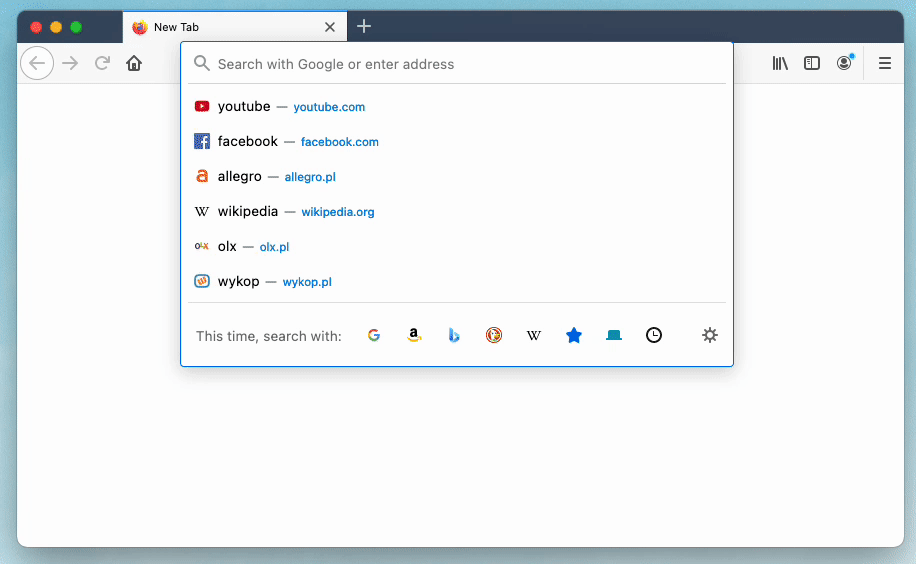

# Pismo Święte – rozszerzenie do przeglądarki



## Instalacja

Firefox: https://addons.mozilla.org/pl/firefox/addon/pismo-święte/

Chrome: https://chrome.google.com/webstore/detail/pismo-święte/caimmofgkhecbgeiablaonampaejhcgj?hl=pl

## Dla programistów

### Przygotowanie

```bash
git clone https://github.com/hejmsdz/bible-web-extension
cd bible-web-extension
npm install
```

### Uruchomienie

```bash
npm run start:firefox
# lub
npm run start:chrome
```

### Budowanie

```bash
npm run build
```

